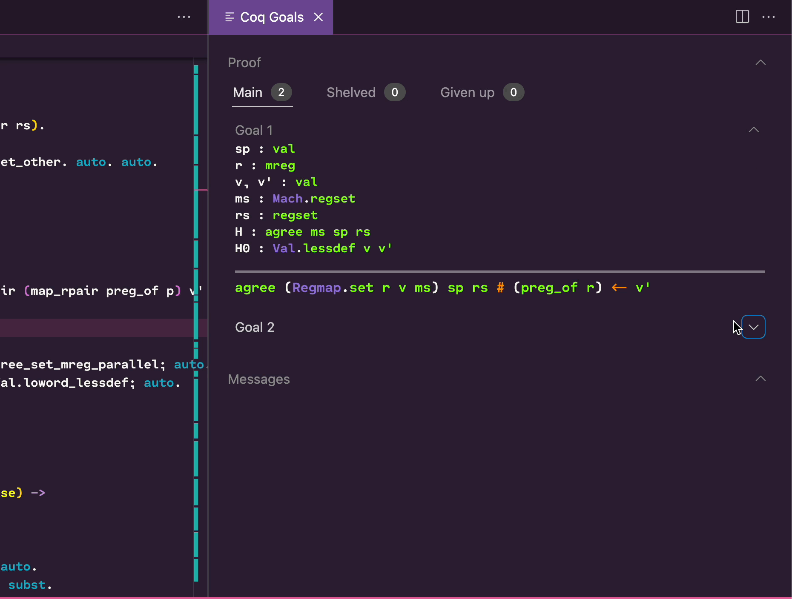
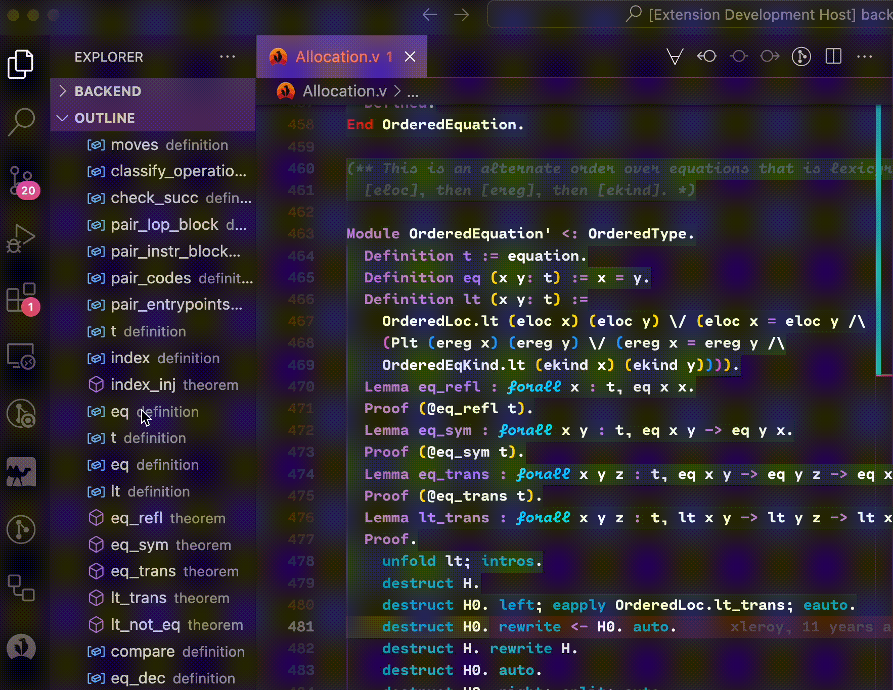
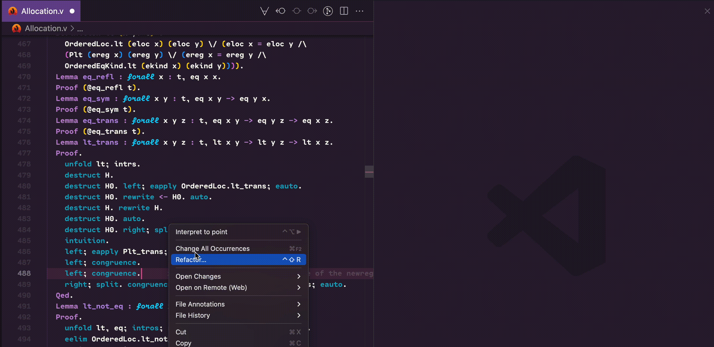

[![CI][action-shield]][action-link]
[![Contributing][contributing-shield]][contributing-link]
[![Code of Conduct][conduct-shield]][conduct-link]
[![Zulip][zulip-shield]][zulip-link]

[action-shield]: https://github.com/coq-community/vscoq/actions/workflows/ci.yml/badge.svg?branch=main
[action-link]: https://github.com/coq-community/vscoq/actions?query=workflow:ci

[contributing-shield]: https://img.shields.io/badge/contributions-welcome-%23f7931e.svg
[contributing-link]: https://github.com/coq-community/manifesto/blob/master/CONTRIBUTING.md

[conduct-shield]: https://img.shields.io/badge/%E2%9D%A4-code%20of%20conduct-%23f15a24.svg
[conduct-link]: https://github.com/coq-community/manifesto/blob/master/CODE_OF_CONDUCT.md

[zulip-shield]: https://img.shields.io/badge/chat-on%20zulip-%23c1272d.svg
[zulip-link]: https://coq.zulipchat.com/#narrow/stream/237662-VsCoq-devs.20.26.20users

VsCoq is an extension for [Visual Studio Code](https://code.visualstudio.com/)
(VS Code) and [VSCodium](https://vscodium.com/) which provides support for the [Coq Proof
Assistant](https://coq.inria.fr/).

VsCoq is distributed in two flavours:

- **VsCoq Legacy** (required for Coq < 8.18, compatible with Coq >= 8.7) is based on the original 
  VsCoq implementation by [C.J. Bell](https://github.com/siegebell). It uses the legacy XML protocol 
  spoken by CoqIDE.\
  For more information, see the [VsCoq 1 branch](https://github.com/coq-community/vscoq/tree/vscoq1).
  *Please note it is no longer actively developed, but still maintained for compatibility purposes.*

- **VsCoq** (recommended for Coq >= 8.18) is a full reimplementation around a
  language server which natively speaks the 
  [LSP protocol](https://learn.microsoft.com/en-us/visualstudio/extensibility/language-server-protocol?view=vs-2022).

## Supported Coq versions

**VsCoq** supports all recent Coq versions >= 8.18.

## Installing VsCoq

To use VsCoq, you need to (1) install the VsCoq language server
and (2) install and configure the VsCoq extension in either VS Code or VSCodium.

### Installing the language server

After creating an opam switch, pin Coq,
and install the `vscoq-language-server` package:
```shell
$ opam pin add coq 8.18.0
$ opam install vscoq-language-server
```

After installation, check that you have `vscoqtop` in your shell
and note the path to this executable:
```shell
$ which vscoqtop
```

#### Pre-release versions

We often roll out pre-release versions. To get the correct language server version please pin the git repo. For example,
for pre-release ```v2.1.5```:
```shell
$ opam pin add vscoq-language-server.2.1.5  https://github.com/coq-community/vscoq/releases/download/v2.1.5/vscoq-language-server-2.1.5.tar.gz
```

### Installing and configuring the extension

To install the [VS Code](https://marketplace.visualstudio.com/items?itemName=maximedenes.vscoq)
or [VSCodium extension](https://open-vsx.org/extension/maximedenes/vscoq), first run `code`
or `codium`. Then press F1 to open the command palette, start typing
"Extensions: Install Extension", press enter, and search for "vscoq". Switch to
the **pre-release version** of the extension and enable it. Finally, go to the extension
settings and enter the `vscoqtop` full path from above in the field "Vscoq: Path".

If you want asynchronous processing of Coq files, you can go to
the "Proof: Mode" and select "Continuous". Otherwise, processing will step by step and top-down as in VsCoq1.

#### Pre-release versions

In VsCode, from the extensions page, either use the drop down menu from the ```Uninstall``` button and select ```Install another version```, or click on ```Switch to pre-release```.

## Features
* Syntax highlighting
* Asynchronous proof checking
* Continuous and incremental checking of Coq documents

The new version of vscoq allows users to opt for continuous checking, see the goal panel update as you scroll or edit your document.


By default vscoq is configured to use classic step by step checking mode. 


* Customisable goal panel 
  
Users can choose their preferred display mode, see goals in accordion lists...


... Or organized in tabs. 


* Dedicated panel for queries and their history

We now support a dedicated panel for queries. We currently support Search, Check, About, Locate and Print with plans 
to add more in the future.


* Messages in the goal panel

We also support inline queries which then trigger messages in the goal panel.


* Supports \_CoqProject

### Since version 2.1.7

* Outline

We now support a document outline, which displays theorems and definitions in the document.



* Ellipsis for the goal panel

Goals can now be ellided. First through the `"vscoq.goals.maxDepth"` setting which ellides a goal if the display becomes to large.
Finally by clicking on the goal view as showcased here.


* Quickfixes (only for Coq >= 8.21)

We have added support for quickfixes. However, quickfixes rely on some Coq API which will only make it in the 8.21 release.
Developpers are encouraged to list and add their own quickfixes in the Coq source code.


* Block on first error

We support the classic block on error mode, in which the execution of a document is halted upon reaching an error. This affects both checking modes (Continuous and Manual). A user can opt out of this execution mode by setting it to false in the user settings.



### Settings
After installation and activation of the extension:

(Press `F1` and start typing "settings" to open either workspace/project or user settings.)
#### Coq configuration
* `"vscoq.path": ""` -- specify the path to `vscoqtop` (e.g. `path/to/vscoq/bin/vscoqtop`)
* `"vscoq.args": []` -- an array of strings specifying additional command line arguments for `vscoqtop` (typically accepts the same flags as `coqtop`)
* `"vscoq.trace.server": off | messages | verbose` -- Toggles the tracing of communications between the server and client

#### Memory management (since >= 2.1.7)
* `"vscoq.memory.limit: int` -- specifies the memory limit (in Gb) over which when a user closes a tab, the corresponding document state is discarded in the server to free up memory. Defaults to 4Gb.

#### Goal and info view panel
* `"vscoq.goals.display": Tabs | List` -- Decide whether to display goals in separate tabs or as a list of collapsibles.
* `"vscoq.goals.diff.mode": on | off | removed` -- Toggles diff mode. If set to `removed`, only removed characters are shown (defaults to `off`)
* `"vscoq.goals.messages.full": bool` -- A toggle to include warnings and errors in the proof view (defaults to `false`)
* `"vscoq.goals.maxDepth": int` -- A setting to determine at which point the goal display starts elliding. Defaults to 17. (since version >= 2.1.7)

#### Proof checking
* `"vscoq.proof.mode": Continuous | Manual` -- Decide whether documents should checked continuously or using the classic navigation commmands (defaults to `Manual`)
* `"vscoq.proof.cursor.sticky": bool` -- a toggle to specify whether the cursor should move as Coq interactively navigates a document (step forward, backward, etc...)
* `"vscoq.proof.delegation": None | Skip | Delegate` -- Decides which delegation strategy should be used by the server. 
  `Skip` allows to skip proofs which are out of focus and should be used in manual mode. `Delegate` allocates a settable amount of workers
  to delegate proofs. 
* `"vscoq.proof.workers": int` -- Determines how many workers should be used for proof checking
* `"vscoq.proof.block": bool` -- Determines if the the execution of a document should halt on first error.  Defaults to true (since version >= 2.1.7).

#### Code completion (experimental)
* `"vscoq.completion.enable": bool` -- Toggle code completion (defaults to `false`)
* `"vscoq.completion.algorithm": StructuredSplitUnification | SplitTypeIntersection` -- Which completion algorithm to use
* `"vscoq.completion.unificationLimit": int` -- Sets the limit for how many theorems unification is attempted

#### Diagnostics
* `"vscoq.diagnostics.full": bool` -- Toggles the printing of `Info` level diagnostics (defaults to `false`)

## For extension developers 
See [Dev docs](https://github.com/coq-community/vscoq/blob/main/docs/developers.md)

## Maintainers

This extension is currently developed and maintained as part of
[Coq Community](https://github.com/coq-community/manifesto) by
[Enrico Tassi](https://github.com/gares),
[Romain Tetley](https://github.com/rtetley).

**VsCoq Legacy** is no longer actively developed but is still maintained for compatibility
purposes. It was developed and maintained by
[Maxime Dénès](https://github.com/maximedenes),
[Paolo G. Giarrusso](https://github.com/Blaisorblade),
[Huỳnh Trần Khanh](https://github.com/huynhtrankhanh),
[Laurent Théry](https://github.com/thery),
and contributors.

## License
Unless mentioned otherwise, files in this repository are [distributed under the MIT License](LICENSE).

The files `client/syntax/coq.tmLanguage` and `client/coq.configuration.json` are
also distributed under the MIT License, Copyright (c) Christian J. Bell and
contributors.
