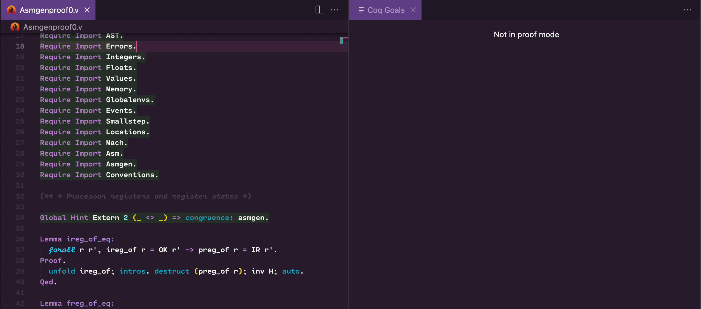
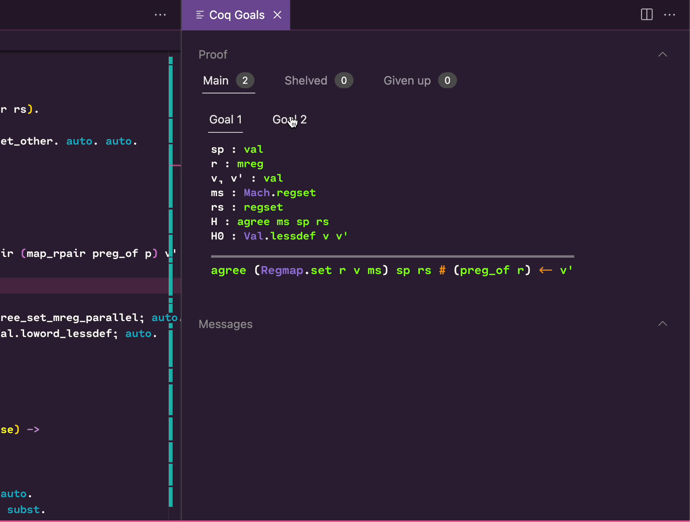

[![CI][action-shield]][action-link]
[![Contributing][contributing-shield]][contributing-link]
[![Code of Conduct][conduct-shield]][conduct-link]
[![Zulip][zulip-shield]][zulip-link]

[action-shield]: https://github.com/coq-community/vscoq/actions/workflows/ci.yml/badge.svg?branch=main
[action-link]: https://github.com/coq-community/vscoq/actions?query=workflow:ci

[contributing-shield]: https://img.shields.io/badge/contributions-welcome-%23f7931e.svg
[contributing-link]: https://github.com/coq-community/manifesto/blob/master/CONTRIBUTING.md

[conduct-shield]: https://img.shields.io/badge/%E2%9D%A4-code%20of%20conduct-%23f15a24.svg
[conduct-link]: https://github.com/coq-community/manifesto/blob/master/CODE_OF_CONDUCT.md

[zulip-shield]: https://img.shields.io/badge/chat-on%20zulip-%23c1272d.svg
[zulip-link]: https://coq.zulipchat.com/#narrow/stream/237662-VsCoq-devs.20.26.20users

VsCoq is an extension for [Visual Studio Code](https://code.visualstudio.com/)
(VS Code) and [VSCodium](https://vscodium.com/) with support for the [Coq Proof
Assistant](https://coq.inria.fr/).

This extension is currently developed and maintained as part of
[Coq Community](https://github.com/coq-community/manifesto) by
[Maxime Dénès](https://github.com/maximedenes),
[Paolo G. Giarrusso](https://github.com/Blaisorblade),
[Huỳnh Trần Khanh](https://github.com/huynhtrankhanh),
[Enrico Tassi](https://github.com/gares),
[Romain Tetley](https://github.com/rtetley),
[Laurent Théry](https://github.com/thery),
and contributors.

## Status

- VsCoq 1 (versions 0.x.y) is based on the original VsCoq implementation by [C.J. Bell](https://github.com/siegebell)
  and compatible with Coq 8.7 or more recent. It uses the legacy XML protocol
  spoken by CoqIDE. For more information, see the
  [VsCoq 1 branch](https://github.com/coq-community/vscoq/tree/vscoq1).
- VsCoq 2 (beta releases versions 1.9.x) is a full reimplementation around a
  language server which natively speaks the LSP protocol. VsCoq 2 is
  compatible with Coq 8.18 or more recent, and supports manual or continuous mode
  checking.

## Installing a VsCoq 2 beta release

To use a beta release of VsCoq 2, you need to (1) install the VsCoq 2 language server
and (2) install and configure the VsCoq extension in either VS Code or VSCodium.

### Installing the language server

The beta releases of the language server are available in the
`extra-dev` [Coq opam repository](https://github.com/coq/opam#usage),
and relies on Coq 8.18+rc1 from the `core-dev` Coq opam repository.

After creating an opam switch, activate these repositories, pin Coq,
and install the `vscoq-language-server` package:
```shell
$ opam repo add coq-core-dev https://coq.inria.fr/opam/core-dev
$ opam repo add coq-extra-dev https://coq.inria.fr/opam/extra-dev
$ opam pin add coq 8.18+rc1
$ opam install vscoq-language-server
```

After installation, check that you have `vscoqtop` in your shell
and note the path to this executable:
```shell
$ which vscoqtop
```

### Installing and configuring the extension

To install the [VS Code](https://marketplace.visualstudio.com/items?itemName=maximedenes.vscoq)
or [VSCodium extension](https://open-vsx.org/extension/maximedenes/vscoq), first run `code`
or `codium`. Then press F1 to open the command palette, start typing
"Extensions: Install Extension", press enter, and search for "vscoq". Switch to
the **pre-release version** of the extension and enable it. Finally, go to the extension
settings and enter the `vscoqtop` full path from above in the field "Vscoq: Path".

If you want top-down processing of Coq files as in VsCoq1, you can go to
the "Proof: Mode" and select "Manual". Otherwise, processing will asynchronous.

## Features
* Syntax highlighting
* Asynchronous proof checking
* Continuous and incremental checking of Coq documents

The new version of vscoq allows for continuous checking, see the goal panel update as you scroll or edit your document.


Note that users can opt out and choose to use the classic step by step checking mode. 


* Customisable goal panel 
  
Users can choose their preferred display mode, see goals in accordion lists...


... Or organized in tabs. 


* Dedicated panel for queries and their history

We now support a dedicated panel for queries. We currently support Search, Check, About, Locate and Print with plans 
to add more in the future.


* Messages in the goal panel

We also support inline queries which then trigger messages in the goal panel.


* Supports \_CoqProject

### Settings
After installation and activation of the extension:

(Press `F1` and start typing "settings" to open either workspace/project or user settings.)
* `"vscoq.path": ""` -- specify the path to `vscoqtop` (e.g. `path/to/vscoq/bin/vscoqtop`)
* `"vscoq.args": []` -- an array of strings specifying additional command line arguments for `vscoqtop` (typically accepts the same flags as `coqtop`)

## License
Unless mentioned otherwise, files in this repository are [distributed under the MIT License](LICENSE).

The files `client/syntax/coq.tmLanguage` and `client/coq.configuration.json` are
also distributed under the MIT License, Copyright (c) Christian J. Bell and
contributors.
